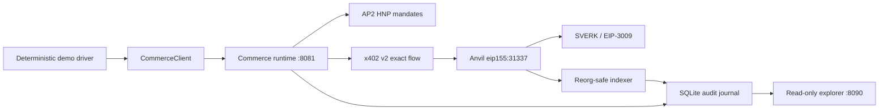

# Payments architecture

The payments subsystem is an optional sidecar domain. Existing drone roles,
survey phases, ROS bridge, rover integration and competition web pages have no
dependency on it.

The LLM-facing boundary is proposal-oriented. It can list services, open a
negotiation, propose/accept/reject a known offer, purchase an immutable quote,
and read the resulting payment. It cannot select an address, supply a private
key, create a raw x402 payload, or request an arbitrary crypto transfer.

The chain transaction contains only token movement. The human-readable service
description is taken from the seller-signed Checkout JWT after AP2 verification
and linked to the transaction by the signed Payment Receipt. No audit contract
is required for this local demonstration.

For operating and testing the stack, see
[`payments/README.md`](../payments/README.md).
