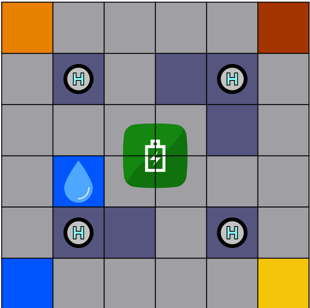
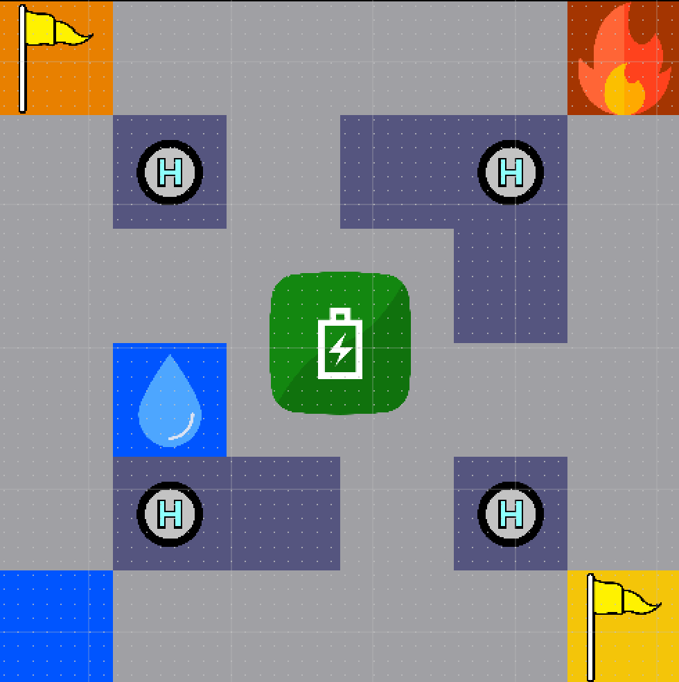

# Регламент проведения соревнования «Город дронов: социум ИИ агентов»

2026

> Расшифровка PDF `Регламент_Город_дронов_Архипелаг_2026_1.pdf` (15 страниц, получен 2026-07-27).
> Это **единственный актуальный регламент**; предыдущая редакция (с внутренней валютой и экономическим механизмом) отменена.
> Текст приведён к читаемому виду: вычищены разрывы внутри слов и артефакты вёрстки PDF, содержание не изменено.
> Замеченные противоречия и опечатки исходника собраны в конце файла.

---

## 1. Общие положения

Настоящий Регламент проведения соревнования «Город дронов: социум ИИ агентов» (далее — Регламент) определяет порядок организации и проведения соревнования (далее — Соревнование). Соревнование является очным техническим мероприятием и проводится в соответствии с настоящим Регламентом.

Предметом соревнования является разработка операционной системы города дронов — многоагентной автономной системы управления модельной городской средой, в которой дроны, роверы и городские сущности действуют как ИИ-агенты. Система должна выполнять городские миссии, распределять ограниченные ресурсы дорожной сети, обеспечивать безопасное движение и адаптироваться к изменяющимся условиям. Все действия выполняются автономно, без непосредственного управления человеком в реальном времени.

### 1.1. Цели соревнования

Целями проведения Соревнования являются выявление перспективных специалистов в области программирования беспилотных летательных и наземных аппаратов с высоким уровнем квалификации, способных решать отраслевые задачи в интересах технологического развития Российской Федерации, а также формирование профессионального сообщества, готового предлагать и реализовывать инновационные идеи в данной сфере.

### 1.2. Задачи соревнования

Задачами проведения соревнования являются:

- Определение лучших специалистов и команд в области разработки автономных многоагентных систем управления разными типами дронов и роверами на основе результатов проведённых зачётных попыток.
- Выявление новых подходов к взаимодействию ИИ-агентов, применению LLM/VLM, распределению ограниченных ресурсов и автономному управлению смешанным движением беспилотных летательных и наземных аппаратов.
- Повышение интереса молодых инженеров и программистов к разработке программных решений для беспилотных летательных аппаратов, мобильных роботов и многоагентных систем, стимулирование обмена опытом и знаниями между участниками.

### 1.3. Порядок организации соревнования

Соревнования проводятся в 2 этапа: заочный (квалификационный отбор) и очный (финальный).

**Заочный этап** — является квалификационным отбором, в ходе которого команды самостоятельно выполняют задания, направленные на проверку их компетенций. Описание заданий заочного этапа и необходимые материалы размещены в Приложении 2.

**Очный этап** — прохождение конкурсных заданий с полным соблюдением условий на предоставленной специализированной площадке в течение 4 дней.

- **Сроки и место проведения:** соревнование проводится с 27 по 30 июля 2026 года на площадке по адресу `_______` (в исходном PDF адрес не заполнен).
- **Участники:** к участию допускаются команды в составе от 4 до 6 человек, возраст — 14 лет и старше. Всего к участию планируется допустить до 6 команд (максимально 36 участников).
- **Дни 1–3** — тренировочный этап. **День 4** — зачётная попытка длительностью до 15 минут.

Все зачёты фиксируются на видео экспертами для последующего разбора спорных ситуаций и оценки. Экспертная комиссия присутствует при проведении зачётных попыток, осуществляет наблюдение за соблюдением правил и ведёт подсчёт очков. По завершении каждой зачётной попытки эксперты заносят результаты (набранные очки, штрафные баллы при нарушениях) в протокол.

---

## 2. Конкурсное задание

### 2.1. Общее описание задания

Команда разрабатывает прототип операционной системы города дронов на базе 4 квадрокоптеров «Сверх» с камерами и нейроускорителями, платформы микродрона «Сверх» и одного командного ровера «Сверх».

Физическая конфигурация городского поля доводится до участников в начале очного этапа и используется для тренировочных и зачётных попыток. Сценарий зачётной попытки, включая набор городских миссий, условия начисления результата, начальные ограничения и возможные события, выдаётся организаторами перед началом или в момент старта попытки.

Городские миссии включают доставку грузов из точки A в точку B, имитацию тушения пожара в городе, срочное реагирование или иные задания, определённые сценарием. Каждая миссия может иметь условия выполнения, контрольные зоны, ограничения и дедлайн.

Дроны, роверы и при необходимости виртуальные сущности представляются в системе как ИИ-агенты. Агент может действовать от лица дрона-монитора, командного ровера или микродрона, обеспечивающего безопасность.

**Дроны-мониторы** наблюдают за городской сетью с воздуха, распознают роверы, перекрёстки, ArUco-маркеры, здания и инциденты. Результаты наблюдений используются агентами для выбора миссий, построения маршрутов, согласования движения и реакции на изменения обстановки.

**Командный ровер** выполняет городские миссии и стремится получить максимальный итоговый результат за ограниченное время. Система самостоятельно выбирает порядок выполнения миссий, строит маршруты и принимает решения о проезде, ожидании, уступке или объезде.

**Микродрон «Сверх»** выполняет роль вспомогательного агента для командного ровера: автономно следует за ним, контролирует ближнюю зону, фиксирует опасное сближение или столкновение, обрабатывает визуальную информацию, получаемую с бортовой камеры.

Система должна использовать **LLM/VLM** для анализа городской обстановки, интерпретации событий, формирования решений агентов, согласования действий и/или объяснения принятых решений.

**Цели команды:**

1. Выполнить все городские миссии за время зачётной попытки.
2. Получить максимальное итоговое количество баллов.
3. Реализовать обмен сообщениями и согласование действий между агентами.
4. Автономно строить планы в соответствии с условиями на игровом поле.

В `README.md` команда кратко описывает архитектуру агентной системы, используемые LLM/VLM-компоненты, логику выбора миссий и маршрутов, экономический механизм, работу микродрона безопасности и формат логов решений.

### 2.2. Порядок проведения соревнований

1. Организаторы оставляют за собой право вносить изменения в правила безопасности и эксплуатационные ограничения площадки в зависимости от состояния оборудования, поля или иных факторов. Все изменения будут озвучены участникам перед началом рабочего дня.
2. Соревнование проводится в один уровень сложности. Все команды работают с одинаковыми условиями, составом предоставленного оборудования и конфигурацией городского поля.
3. Конфигурация городского поля доводится до участников в начале очного этапа. В течение первых трёх дней команды выполняют тестовые попытки, отладку программного решения и настройку взаимодействия с предоставленным оборудованием. В конце третьего дня очного этапа проводится техническая защита решений команд. На технической защите должны присутствовать не менее двух представителей команды.
4. Количество тестовых попыток не ограничено, длительность одной — до 15 минут.
5. В приоритете команды, у которых было меньшее количество тестовых попыток. Далее — живая очередь.
6. На четвёртый день проводится зачётная попытка длительностью до 15 минут, определяющая результат команды по блоку зачётной попытки.
7. Перед началом зачётной попытки организаторы определяют сценарий попытки: набор городских миссий и начальные ограничения.
8. Во время зачётной попытки дроны и ровер должны быть размещены на назначенных стартовых позициях. Пульты управления должны находиться у участника и быть включены для аварийного перехвата.
9. Участники должны заблаговременно подходить к полётной зоне и покидать её по завершении. После окончания попытки команда обязана завершить полёт, остановить движение аппаратов и покинуть зону.
10. По завершении попытки эксперты заносят оценки в оценочный лист с учётом результата зачётной попытки и технической защиты. После подписания оценочного листа подача апелляции невозможна.
11. Отказ от подписания оценочного листа — основание для дисквалификации.
12. Изменять элементы полигона, дорожной сети, зданий и контрольных зон запрещено, при необходимости стоит проконсультироваться с экспертами.

### 2.3. Оценка конкурсных заданий

#### 2.3.1. Заочный этап

Таблица критериев оценивания:

| Критерий | Кол-во баллов |
|---|---|
| Подключение к интерфейсу работы с OpenClaw и запуск симуляционной сцены на платформе | 10 баллов |
| Формирование и отправка управляющих команд через текстовые сообщения | 15 баллов |
| Корректное управление дроном в симуляторе: взлёт, стабилизация, изменение направления и скорости | 15 баллов |
| Прохождение сегментов лабиринта без столкновений или пролёт через бублик по условиям задания | 25 баллов |
| Посадка дрона на финише | 20 баллов |
| Воспроизводимость выполнения, наличие записи или логов и краткого описания решения | 15 баллов |
| **ИТОГО** | **100 баллов** |

#### 2.3.2. Очный этап

1. Судейство соревнований осуществляется экспертной комиссией (не менее 3 человек). Оценка очного этапа включает результат зачётной попытки и техническую защиту решения.
2. Оценка осуществляется непосредственно в день соревнований по итогам выполнения городских миссий, соблюдения правил движения, работы агентной системы и представления технического решения.
3. Используется **150-балльная система оценки**: до 100 баллов за зачётную попытку и до 50 баллов за техническую защиту.
4. Защита технического решения будет проходить в формате презентации, в которой команда расскажет об использовании моделей LLM/VLM, методах обработки данных, принципах принятия решений агентами, а также продемонстрирует свои креативные подходы к выполнению поставленного задания. Количество баллов за каждый пункт определяется экспертами хакатона.
5. Критерии разбалловки зачётной попытки команды получают в начале первого дня на площадке проведения хакатона.

Таблица критериев оценивания технической защиты:

| Критерий | Кол-во баллов |
|---|---|
| Использование LLM/VLM, обработка данных и принятие решений агентами | 30 баллов |
| Креативность решения выполнения задания | 20 баллов |
| **ИТОГО за техническую защиту** | **50 баллов** |

Если во время тестовой или зачётной попытки БПЛА приходит в неисправное состояние, участник осуществляет ремонт самостоятельно, время попытки не останавливается.

##### 2.3.2.1. Обзор агентов

Базовые скиллы агентов закладывают организаторы, участники могут использовать готовые скиллы для выполнения задания или переписать их под своё решение.

**Диспетчер.** Планировщик задач, который оценивает ситуацию на поле и раздаёт команды остальным агентам. Программируется участниками.

Должен уметь:

- Получать и считывать изображения с четырёх дронов-мониторов.
- Обрабатывать изображения.
- Пересылать команды или наборы команд другим агентам (агентам-исполнителям).

**Дрон-монитор** (Набор «Сверх.Рой» на ROS 2 с NPU). Четыре разведывательных дрона, которые в начале заезда взлетают и зависают над полем, передавая изображения с камер агенту-диспетчеру для дальнейшей обработки. Умеют обрабатывать изображения на борту.

Должен уметь:

- Взлетать.
- Перемещаться в заданную координату.
- Передавать изображения с камеры.
- Обрабатывать изображения с камеры.

**Командный ровер** (Ровер средний). Основной элемент управления для участников. Именно с его передвижением по карте связана основная часть большинства заданий. По сути, это ROS 2-ровер с навигацией по лидару и опознавательным маркером сверху.

Должен уметь:

- Перемещение из точки А на карте в точку В на карте.
- Включение и выключение мигалки.

**Вспомогательный дрон** (ВУП, Микродрон «Сверх» с NPU). Дополнительный подвижный элемент для участников. По логике заданий он является вспомогательным по отношению к роверу. В этом задании дрон используется ограниченно, однако он также задействован.

Должен уметь:

- Лететь из точки А на карте в точку В на карте.
- Менять высоту полёта.
- Взлетать и садиться.
- Следовать за заданной целью.

##### 2.3.2.2. Обзор игрового поля



*Макет поля*

Игровое поле представляет собой макет города. Всё пространство разбито на сетку из 36 одинаковых ячеек размером 80 × 80 сантиметров (6 на 6 клеток), которые делятся на клетки-дороги, определяемые по координатам, и четыре цветные «зоны интереса» — Районы. В этих цветных районах будут располагаться целевые задания, а свободное место между дорогами и площадями неравномерно заполнено макетами домов. При этом высота зданий подобрана так, чтобы лидар ровера мог беспрепятственно сканировать пространство и точно определять положение робота в городе.

В самом центре поля находится стартовая зона, совмещённая с игровой станцией зарядки ровера (станция не влияет на реальный заряд ровера, а используется для симуляции процесса зарядки), а рядом с ней установлена водонапорная вышка. На крышах домов в четырёх фиксированных точках оборудованы специальные взлётные площадки для дронов-мониторов с разметкой ArUco-маркеров для локализации.

> На макете различимы: четыре цветных района в углах поля (оранжевый, красно-коричневый, синий, жёлтый), четыре взлётные площадки с символом «H», зелёная клетка станции зарядки в центре и синяя клетка с каплей — водонапорная вышка.

##### 2.3.2.3. Обзор задания очного этапа хакатона

Команде предлагается создать агента-диспетчера, который будет руководить дронами и ровером для выполнения миссии, заданной организаторами. После этого участники передают информацию о задании агенту-диспетчеру, и задание должно быть выполнено автономно.

**Заряд ровера.** На момент начала попытки у ровера 0 единиц заряда. Одна секунда неподвижного нахождения в зоне зарядки (зоне старта) соответствует одному перемещению в соседнюю клетку. Агент-диспетчер должен заранее рассчитать, сколько перемещений потребуется для выполнения всего задания, либо после выполнения одной или двух миссий подзарядить ровер в зоне зарядки (зоне старта). Движение ровера после полной разрядки автоматически блокируется.

У каждой миссии есть свой уровень опасности. Если остаются миссии равного приоритета, агент-диспетчер может самостоятельно выбирать порядок их выполнения.

###### Миссия «Пожар»

В одном из районов города произошло серьёзное возгорание. Уровень пожара определяется и считывается с помощью дронов-мониторов. Число на маркере обозначает уровень пожара и количество поездок за водой к водонапорной башне. Необходимо оперативно направить машину служб реагирования (командный ровер) к месту происшествия, предварительно заехав к клетке водонапорной башни, расположенной на поле. Повторить этот набор действий столько раз, какому числу равен уровень пожара. После этого пожар считается потушенным.

Параллельно требуется обеспечить безопасность периметра с воздуха. Вспомогательный дрон (ВУП) в районе, где происходит пожар, должен найти человека в окнах здания, где происходит пожар.

Пример выполняемых действий:

1. С помощью четырёх дронов-мониторов агент-диспетчер определяет точные координаты очага пожара (обозначенного элементом огня или специальным маркером) и уровень возгорания.
2. Диспетчер отправляет роверу пакет команд для перемещения к клетке, в которой находится водонапорная башня.
3. Когда ровер прибывает в ячейку и заправляется водой для тушения пожара, он должен начать мигать светодиодной лентой и остановиться ровно на 3 секунды. Пропуск этого шага или продолжение движения без фиксации времени аннулирует результат забора воды.
4. Только после трёхсекундной паузы и включения индикации диспетчер имеет право отправить ровер дальше — к клетке, где происходит пожар.
5. Вспомогательный дрон (ВУП) должен пролететь до района, в котором возник пожар, и, используя бортовую камеру дрона, найти и определить человека в окнах здания, где происходит пожар. Результат детекции должен быть передан агенту-диспетчеру.

###### Миссия «Доставка»

В рамках развития городской логистики необходимо выполнить оперативную доставку ценного груза из одного района в другой. Приоритет миссии — обеспечение повышенной безопасности транспортировки на протяжении всего наземного пути силами воздушного эскорта. Если миссия «Пожар» не выполнена, доставлять груз через клетку, в которой происходит возгорание, нельзя.

Необходимые действия:

1. С помощью системы дронов-мониторов диспетчер определяет точное расположение стартовой клетки доставки и клетки финиша. Они обозначаются специальными маркерами на полу перед началом заезда.
2. Диспетчер отправляет командный ровер в стартовую клетку доставки.
3. По прибытии на старт ровер обязан сделать технологическую остановку ровно на 5 секунд (имитация процесса безопасной погрузки контейнера на платформу), в процессе которой подавать соответствующий сигнал с помощью бортового светодиода.
4. После завершения пятисекундного ожидания диспетчер отправляет ровер по оптимальному маршруту к клетке финиша доставки.
5. В момент начала движения ровера со старта активируется вспомогательный дрон (ВУП). Он должен взлететь и осуществлять непрерывное воздушное сопровождение, следуя строго сзади ровера и не отставая от него более чем на две клетки на протяжении всего пути до финиша.
6. На протяжении всей миссии (от начала движения до успешного прибытия на финиш) у командного ровера должна быть непрерывно включена световая мигалка.

**Победителем** признаётся команда, набравшая наибольшее количество баллов по итогам очного этапа. При равенстве баллов преимущество получает команда с более высоким результатом зачётной попытки; при дальнейшем равенстве — команда, выполнившая больше городских миссий за меньшее время.

В Приложении 3 — тестовое решение одного из вариантов задания очного этапа.

### 2.4. Порядок разрешения спорных вопросов

При возникновении спорных вопросов, не предусмотренных данным регламентом, разрешение производится экспертной комиссией.

В случае несогласия с решением экспертной комиссии допускается подача членом команды апелляции, форма которой представлена в Приложении 1. Апелляция рассматривается главным экспертом соревнований, после чего им же выносится решение о пересмотре результатов соревнования или отклонении апелляции.

### 2.5. Правила поведения участников

- Каждый участник команды должен быть ознакомлен с правилами поведения и правилами безопасности на площадке.
- Каждый участник должен выполнять правила поведения и правила безопасности на площадке.
- Запрещается вмешиваться в выступление других команд, противодействовать их защите.
- Запрещается оскорблять участников, гостей, организаторов и экспертов конкурсного испытания, проявлять действия, противоречащие законам и конституции Российской Федерации.
- При нарушении правил участниками команды по решению комиссии, состоящей из организаторов и экспертов конкурсного испытания, выносится решение о штрафных баллах или дисквалификации всей команды.

### 2.6. Технический регламент беспилотных аппаратов (требования к БАС)

- Размеры каждого аппарата не превышают 0,5 × 0,5 м.
- Высота полёта дронов не превышает 4 м.
- Все аппараты работают автономно под управлением заложенных программ.
- Разрешено только экстренное вмешательство через KILL SWITCH.
- Каждый аппарат обязан иметь механизм Failsafe — отключение при потере сигнала.
- Разрешены любые беспроводные каналы внутри команды (Wi-Fi, ZigBee и др.).
- Запрещён обмен данными между командами во время соревнования.
- Перед каждой попыткой — проверка заряда (не менее 40 %).
- Конструкция аппаратов должна быть безопасной (без острых и торчащих частей).
- Аппараты проходят техническую инспекцию до допуска к соревнованию.

### 2.7. Технический регламент площадки проведения

**Описание полётной зоны и городского поля:**

- Полётная зона представляет собой куб из алюминиевых ферм.
- Размеры куба: не менее 8 × 8 × 4 м (Д × Ш × В).
- Городское поле представляет собой модульную дорожную сеть с клетками, перекрёстками, зданиями, контрольными зонами, стартовыми зонами и зонами выполнения городских миссий. Конкретная конфигурация поля определяется организаторами и доводится до участников в начале очного этапа.

**Описание рабочего места.** Каждой команде будет предоставлено:

| № п/п | Оборудование, инструменты, расходные материалы | Кол-во |
|---|---|---|
| 1 | Набор «Сверх.Рой» на ROS 2 с NPU (4 взаимодействующих квадрокоптера «Сверх» на ROS 2) | 1 шт. |
| 2 | Микродрон «Сверх» с NPU с поддержкой смены АКБ и/или беспроводной зарядки | 1 шт. |
| 4 | Мобильная программируемая платформа (ровер) с бортовым компьютером с NPU | 1 шт. |
| 5 | Ноутбук | 3 шт. |
| 6 | Зарядное устройство для ноутбука | 3 шт. |

*(Нумерация приведена как в исходнике: строка № 3 в таблице отсутствует.)*

### 2.8. Общие правила безопасности

1. Не допускается запуск дронов вне полётной зоны и вне своего временного слота.
2. Подключение питания к БПЛА с присоединёнными пропеллерами вне полётной зоны строго запрещено.
3. Нахождение в полётной зоне участников в момент запуска БПЛА строго запрещено.
4. При выявлении неисправности прототипа его дальнейшая эксплуатация запрещена до устранения неполадок.
5. На каждом БПЛА должна быть настроена функция экстренного отключения «KILL SWITCH». Работа данной функции должна быть продемонстрирована участниками команды перед началом первого тестового полёта.
6. В случае возникновения угрозы безопасности при выполнении полёта организаторы вправе прервать полёт до устранения угрозы.
7. Во время полёта БПЛА должна быть предусмотрена (настроена) система контроля уровня заряда аккумулятора.
8. При работе с кусачками/бокорезами участник обязан быть в СИЗ органов зрения.
9. При работе с режущим инструментом участник должен быть хотя бы в одной перчатке (на нерабочей руке).
10. Общие правила безопасности могут быть дополнены и озвучены перед началом испытания, в зависимости от погодных условий и фактической застройки площадки.

---

# Приложения

## Приложение 1. Форма апелляции (образец)

```
                              Главному эксперту соревнований
                              «Город дронов: социум ИИ агентов»
                              ________________________
                              Ф.И.О. заявителя
                              ID команды


                                  Апелляция


Прошу Вас рассмотреть апелляцию в связи с тем, что участником/командой _______
(Ф.И.О. человека / ID команды) был нарушен пункт правил № __.


Дата
Подпись
```

## Приложение 2. Задание заочного этапа

**Описание квалификационного задания**

В симуляторе на платформе <https://edu.sverk.tech/task-bank/labirint-openclaw-do-konca> необходимо управлять дроном при помощи OpenClaw:

1. Пользователь подключается к интерфейсу работы с OpenClaw.
2. При помощи текстовых сообщений выполняет управляющие команды.
3. Дрон под управлением OpenClaw проходит сегменты лабиринта без столкновений или пролетает через бублик.
4. Дрон под управлением OpenClaw совершает посадку на финише.

**Форма представления результатов**

Все материалы участники размещают на платформе <https://edu.sverk.tech/>. Эксперты самостоятельно проводят оценку решений и публикацию результатов.

## Приложение 3. Разбор решения примера задания очного этапа



*Пример поля перед попыткой*

Перед попыткой: организаторы выставляют пожар в красном районе, старт доставки — в жёлтом, конец — в оранжевом.

1. Дроны-мониторы взлетают в воздух и передают изображения Диспетчеру. После этого дроны садятся.
2. Диспетчер определяет положения миссий. Посылает на ровер информацию стоять на месте 40 секунд, чтобы зарядиться на 40 единиц заряда.
3. После зарядки Диспетчер отправляет команду на ровер доехать до водонапорной станции и наполнить бак с водой.
4. После этого Диспетчер выдаёт команду на ровер ехать в клетку с пожаром и тушить его. Умный дрон так же вылетает в клетку с пожаром и начинает искать окно с пострадавшим человеком.
5. Сложность пожара равна 2 — ровер должен осуществить тушение 2 раза.
6. Ровер повторяет тушение, Дрон находит пострадавших. Миссия «Пожар» выполнена.
7. Ровер выдвигается в жёлтый район для загрузки доставки.
8. Загрузив доставку, ровер едет в оранжевый район. За ним следует Умный дрон.

---

## Замеченные проблемы в тексте регламента

Перечень мест, где исходный PDF противоречит сам себе или недоговаривает. Проверять у экспертов, а не додумывать.

1. **Разбалловка зачётной попытки не опубликована.** Указано только, что она даёт до 100 баллов из 150, а критерии команды «получат в начале первого дня на площадке» (п. 5 в 2.3.2). Как распределяются баллы между миссиями, штрафами и логами — неизвестно.
2. **Логи решений отдельно не оплачиваются.** В предыдущей редакции они были самостоятельным пунктом начисления; здесь логи упомянуты только в требованиях к `README.md` и в критерии заочного этапа («наличие записи или логов»). При этом технической защите отведено 30 баллов за «использование LLM/VLM, обработку данных и принятие решений агентами» — демонстрировать это без логов нечем.
3. **Экономический механизм упомянут только в требованиях к `README.md`**, но нигде в задании больше не описан: ни внутренней валюты, ни наград, ни цен за ресурсы. Судя по всему, остаток от предыдущей редакции; единственный «ресурсный» механизм в текущем задании — заряд ровера.
4. **«Уровень опасности» миссий не определён.** Сказано, что он есть у каждой миссии и что при равном приоритете диспетчер выбирает порядок сам, но шкала и приоритеты «Пожара» и «Доставки» не заданы.
5. **Единицы заряда ровера ≠ проценты АКБ.** «Одна секунда зарядки = одно перемещение в соседнюю клетку», станция зарядки на реальный заряд не влияет. Это игровой ресурс, который нужно считать самим; при этом п. 2.6 отдельно требует ≥ 40 % реального заряда перед попыткой. Как система узнаёт остаток игрового заряда и кто его блокирует после разрядки — не сказано.
6. **Требования к дронам-мониторам противоречат Приложению 3.** В 2.3.2.1 они «в начале заезда взлетают и зависают над полем», в разборе примера (п. 1) — «после этого дроны садятся».
7. **Адрес площадки не заполнен** — в PDF остались прочерки `_______`.
8. **В таблице оборудования пропущена позиция № 3.** Возможно, потерян пункт при вёрстке.
9. **Пульты управления.** П. 8 в 2.2 требует, чтобы пульты были у участников и включены для аварийного перехвата, — при том что аппаратов на поле шесть (4 монитора + микродрон + ровер), а команда 4–6 человек. Сколько пультов и кто их держит, не сказано.
10. **Опечатки исходника**, устранённые в этой расшифровке: «максимальный итоговое количество баллов», «визуальную информация», «агента-диспетчера может самостоятельно выбирать», «команды получать в начале первого дня», «Базовые скиллы на агентом закладывают организаторы».
